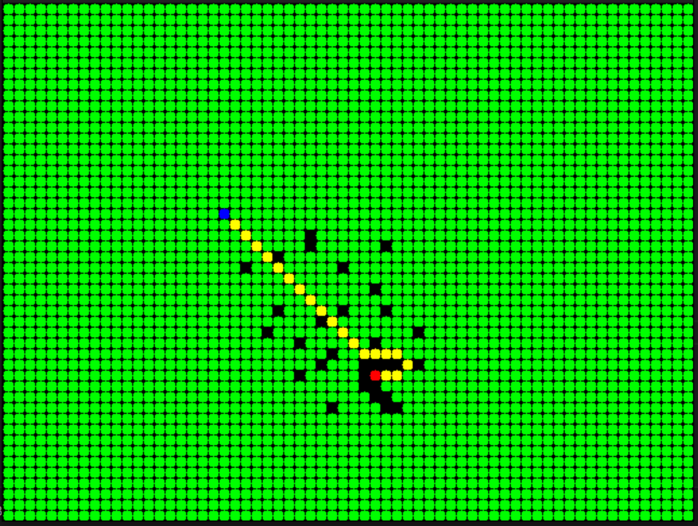
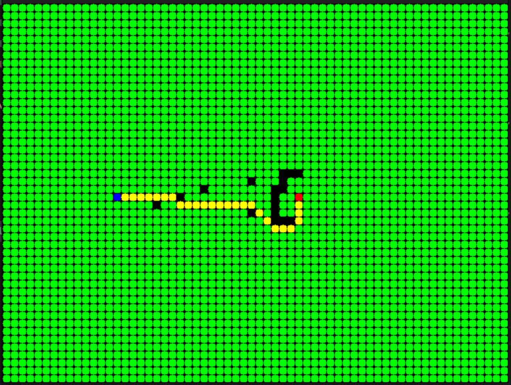

 **A star path finding implementation**

**v1.0.0**

------

# Table of contents

- [Overview](#overview)
- [Instructions](#instructions)
- [Test results](#test-results)

# Overview

This application demonstrates the implementation of the A* algorithm using C++. It leverages OpenCV for visualization purposes.

# Instructions

- Updating the Source Node:

    Position the mouse pointer over the desired node, click the left mouse button, and then press 's' on the keyboard.

- Updating the Destination:

    Position the mouse pointer over the desired node, click the left mouse button, and then press 'd' on the keyboard.

- Adding Obstacles:

    Position the mouse pointer over the desired node, click the left mouse button, and then press 'a' on the keyboard.

- Starting Path Finding:

    Click the right button of the mouse.

# Test results

